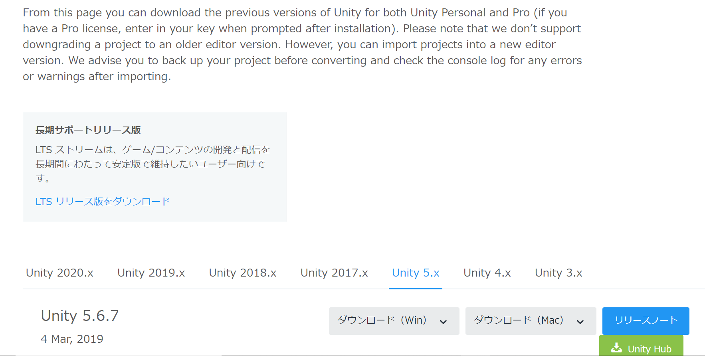

# ノベルゲームの作り方
**ここでは、ジョーカースクリプトというツールを使った ノベルゲームを制作する手順についてまとめています**
 

## ①ジョーカースクリプトのダウンロード
*※このジョーカースクリプトは、最新版のUnityでは動きません。 
バージョンを落としたUnityをダウンロードしてくる必要があります。*

[ジョーカースクリプトのダウンロードページへ](http://jokerscript.jp/home/download)

ダウンロードしたら、展開したファイルを分かりやすい場所に置いておきます。 
(あとで、Unityのエクスプローラからアクセスするので...)

 

## ②Unity5.3.0のダウンロード
以下のページの、「５．X」を押して、下の方に行けばあります。 
[Unityのダウンロードページへ](https://unity3d.com/jp/get-unity/download/archive)

 

**参考画像**

 

## ③ジョーカースクリプトのチュートリアルに沿って進める
あとは、チュートリアルに従って進めれば、かなりクオリティの高いものが出来上がります。
 
[チュートリアルへ進む](http://jokerscript.jp/usage/tutorial/about)

※（2/19追記) 
最新版とどうにか互換性を持たせられないか調整してみたのですが、 
現段階で解決策は見つかっていないので、別バージョンをダウンロードした方が早いです。
