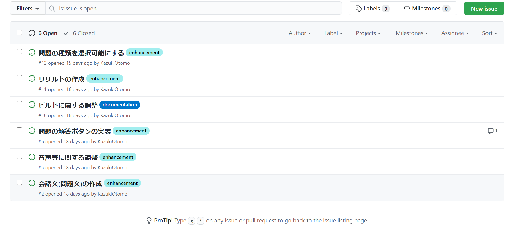

# 集団開発の進め方
2年後期でUnityを使った集団開発をするにあたって、 
その過程で感じたことや、やってよかったこと等をまとめておきます。

## ①計画段階に関して
これは、システム全般を作る際に言えることで、最初の計画・設計で 
出来が決まると言っても過言ではない。それくらい大事。 
ポイントを箇条書きでまとめておきます。 

・ とりあえず最初に、アイデアをみんなで挙げていくといい。（例：どんなゲームを作りたいか、どんなシステムを構築したいか） 
（追記：自分たちは、「ノベルゲームを作りたい」、「スマホでプレイできるようにしたい」といった感じの計画しか立てませんでした） 

・ 次に、そのゲームを作るためにどのような機能が必要か考えていきます。*（ちなみにこれを要件定義といいます）* 

**↓参考画像**

## ②設計段階に関して
設計するにあたって、一番難しいのがイメージの共有だと思います。 
構想がずれてしまえば、各々で機能を開発した後に、一つに合わせるのが難しくなってしまったり... 

自分が思う解決方法は、 

**①、集まって作業するスパンを短めに設定する。** 
これは、プロメンの活動が1週間に1回しか集まらない中でやってきて思ったことです。進捗を生んでこなかったりする人や、蒸発してしまう人が出ても対策しやすくなるのかなぁと思います。 

**②、イメージを絵で共有する** 
どんなにラフな絵でもいいから、ゲーム作りにおいて、どんな画面を作りたいか伝えるためには、絵で伝えてもらう方が自分は作りやすかったですかね。 

**③、メンバーと仲良くする** 
なんだかんだこれが一番大事かもしれないｗ 
意見を気兼ねなく言い合える雰囲気づくりとか、モチベーションを保ちつつお互いに技術やアイデアを共有していけるような環境が作れたら最高だと思います。 

## ③開発段階に関して
作りたい機能を羅列して、タスク分けできたら、担当を決めていきます。 
正直、ここでの振り分け方はそのチームの能力次第だと思う。 
振り分けに関して気を付けるべきこととしては、 

**Ⅰ、タスクは独立させたうえで振り分ける** 
例えば、「キャラの挙動を作る」というタスクと、「キャラの行動に効果音を付ける」といったような 
他のオブジェクトの変数を使わなければいけないようなものは、 
1人で組んでしまった方が良いと思う。 
(ただ、それによって作業量に差が出てしまうのが難点)

**Ⅱ、共有の仕方を何とかする** 
Googleドライブとかで、プレハブとして共有していくこともできるけど、 
個人的にはGithubで共有していくのがおススメしたい 
他の人がどのくらい進捗生んでるのかも確認ができるし、 
就職の時にほとんどのIT系の企業は見ると言っていた。(授業での訪問講師への質問で確認済み) 
問題は、使い方が分かりにくいってところなんだけど、自分に聞いてもらえればある程度使いこなせるようになるまでは教えてあげられると思います。